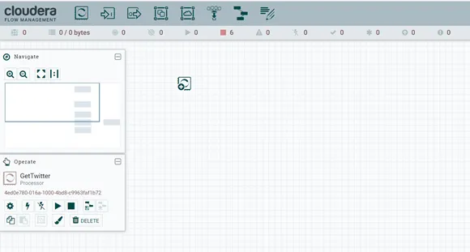
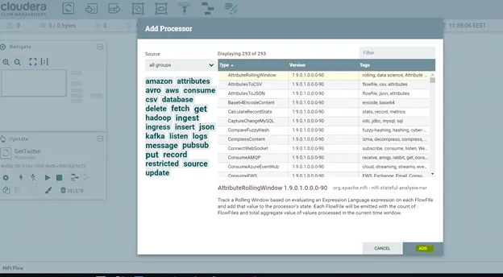
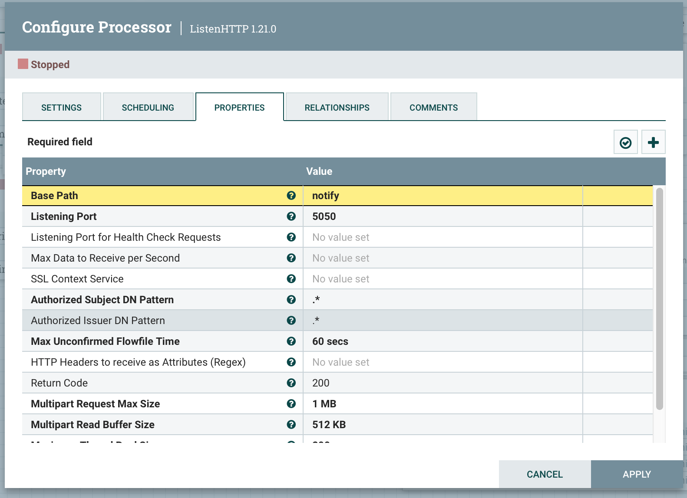
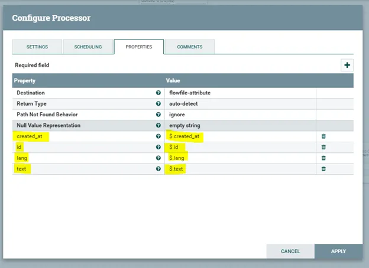
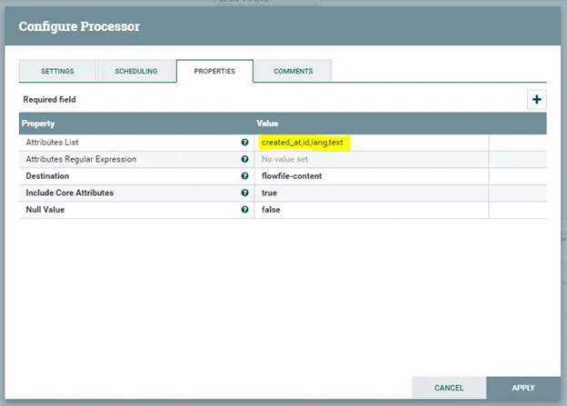
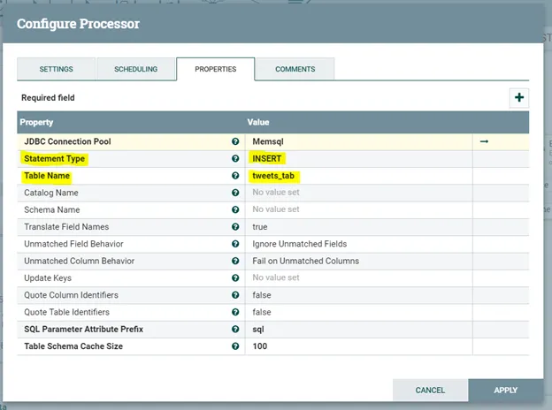
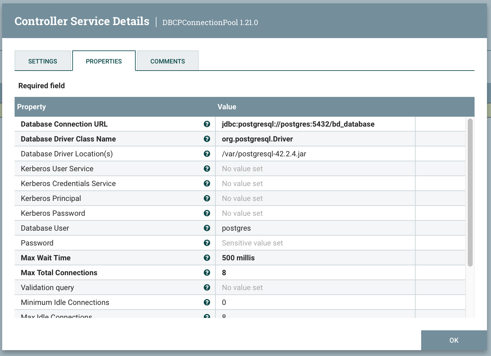
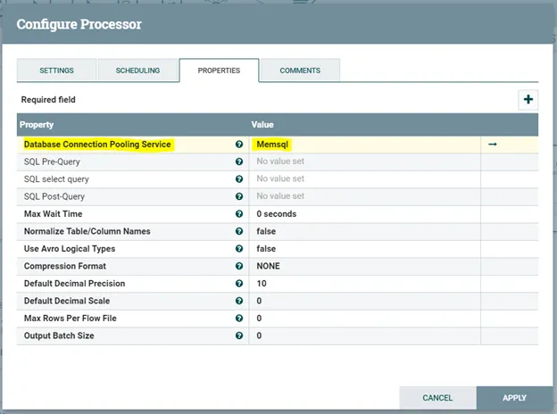
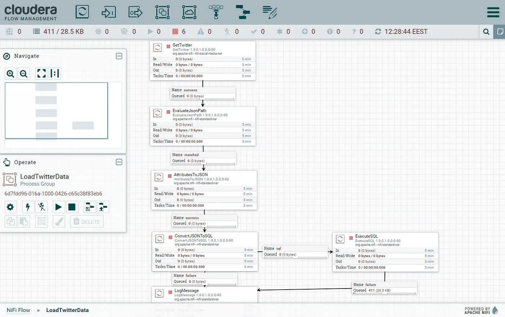

<br/><br/>


# Practica Dataflow - Apache NiFi

## 1. Objetivo

- Afianzar los conceptos sobre sistemas de manipilación de datos en memoria
- Conocer y operar con los distintos procesadores para realizar persitencia de datos con Apache NiFi

## 2. Dependencias

Para realizar la práctica el alumno deberá tener instalado en su ordenador:
- Herramienta GIT para gestión de repositorios [Github](https://git-scm.com/downloads)
- Apache NiFi [NiFi](https://nifi.apache.org)
- Máquina virtual con sistema operativo linux y distribución Ubuntu 22.04 (Disponible en el enlace compartido en moodle) 


## 3. Descripción de la práctica

La práctica plantea un ejercicio que permite identificar el proceso de extracción de datos de una fuente externa, realizar una serie de operaciones sobre  dichos datos  y finalmente guardar el resultado en un sistema de almacenamiento. El objetivo es comprender como funcionna las herrramienta de manipulación de datos en entornos de Big Data, en este caso la herramienta que se utiliza es Apache NiFi.

La práctica está desarrollada en dos bloques. Uno con instrucciones específicas tanto para desplegar el entorno como para configurar los procesadores necsarios para realizar las operaciones previas al almacenamiento de los datos y el otro bloque está definido como un ejercicio de desafío, en el que se  utilizará el desarrollo previo  y además se deberá realizar las configuraciones necesarias para poder almacenar los datos en un sistema de almacenamiento distinto al original.

El primer bloque del desarrollo de la práctica está compuesto por una única instancia de NiFi y una instancia de una base de datos PostgreSQL. Por medio de este entorno se plantea la obtención de datos provenientes de un script que simula el envio de tweets, realizar una pequeña manipulación de dichos datos para adaptarla a un formato específico, para luego almacenar dichos datos en una base de datos creada en PostgreSQL.

Posteriormente en el bloque 2 se plantea utilizar los mismos componentes anteriores pero en este caso en lugar de almacenar los datos en PostgreSQL, se utilizará MongoDB para dicha acción, pasando de almacenar los datos de un esquema realacional en tablas a un no relacional basado en documentos. 


## 4. Inicializar el entorno.

Para la realización de la práctica se ha provisionado una máquina virtual con sistema operativo linux y distribución Ubuntu. En los recursos de Moodle de la asignatura se acceder al enlace de descarga.

Descarge el fichero de VM con extensión .ova e importelo en virtualbox. 

Dentro de la máquina virtual abra un terminal y realice los siguientes pasos.

Clonar el repositorio de la práctica

```
git clone https://github.com/Big-Data-ETSIT/P7_NIFI.git
```
Cambiar la ruta al directorio de la práctica
```
cd ./P7_NIFI
```

Iniciar el los servicios de NiFi, MySQL y Mongo haciendo uso de docker-compose. Para ello ya se porvee del fichero de definicion de dichos servicios:

```
sudo docker compose up -d
```

Verificar que todos los contenedores se encuentran activos
```
sudo docker ps
```
La salida que se debería obtener al ejecutar el comando anterior es la siguiente:

```
CONTAINER ID   IMAGE          COMMAND                  CREATED             STATUS          PORTS                                                   NAMES
10a99e148efc   mongo          "docker-entrypoint.s…"   56 minutes ago      Up 56 minutes   0.0.0.0:27018->27017/tcp                                mongo
bc40bcd833c4   postgres   "docker-entrypoint.s…"   56 minutes ago      Up 56 minutes   0.0.0.0:5432->5432/tcp                                  postgres
2e4ef994f031   apache/nifi    "../scripts/start.sh"    About an hour ago   Up 56 minutes   8000/tcp, 8080/tcp, 10000/tcp, 0.0.0.0:8443->8443/tcp   nifi
```

## 5. Tareas a realizar.

### Bloque 1: Lectura y escritura de eventos por medio un script que simula el envío de tweets y Apache NiFi.

Dado a que se está utilizando un base de datos relacional para escribir los datos de salida, es necesario de que se cree tanto la base de datos como la tabla en donde se van a almacenar dichos datos. Para ello se debe realizar lo siguiente:

**Conectarse a PostgreSQL:**
Acceder a la shell de PostgreSQL, el password de acceso es (`example`):
```
sudo docker exec -it postgres /bin/bash
psql -U postgres 
```
Crear la base de datos `bd_database`:
```
CREATE DATABASE bd_database;
\c bd_database;
```
Crear la tabla donde se almacenarán los tweets `tweets_tab` table:
```
CREATE TABLE tweets_tab(
    CREATED_AT VARCHAR(500),
    ID BIGINT,
    LANG VARCHAR(100),
    TEXT TEXT);
```
Verificar que se ha creado correctamente la tabla:
```
\dt;

```
**Acceder a NiFi**

Abrir el navegador e introducir la siguiente URL:
```
https://localhost:8443/nifi
```
Las credenciales de acceso se encuentran definidas en las variables de entorno del servicio de NiFi del fichero docker-compose.

Dentro de la GUI de NiFi, arrastar el icono de Processor hacia el area de trabajo de NiFi:



Se abrirá una ventana donde se permitirá elegir lo procesadores, en nuestro caso se deben aladir los siguientes:


- ListenHTTP
- EvaluateJsonPath
- AttributesToJSON
- ConvertJSONToSQL
- ExecuteSQL
- LogMessage

**Listen HTTP processor:** Este procesador se utiliza para extraer los datos simulados de los tweets . Necesitamos poner le Base Path y el Listening Port que son los parametros necesarios para recibir las notificaciones.



**EvaluateJsonPath processor:** Este procesador se utiliza para evaluar las expresiones JSON que se extraen de Twitter y, a continuación, asignar el resultado de dichas expresiones a los atributos del archivo de flujo.



**AttributesToJSON:** Este procesador creará un archivo JSON para los atributos del archivo de flujo creados por el procesador anterior.
Usando como directorio de trabajo la carpeta donde se clono el repositorio:


**ConvertJSONToSQL:** Este procesador  convierte un fichero JSON en intrucciones DML (Data Manupulation Languaje). Para usar este procesador es necesario crear un JDBC Connection Pool. 



A continuación se debe añadir un controlador JDBC Connection Pool que se conecta a la base de datos PostreSQL. Crearemos este pool seleccionando "Create New Service" de la lista desplegable en la propiedad JDBC Connection pool. Los pasos para realizar esta configuración serán mostrados en el laboratorio, en donde se incluirán los siguientes datos:





**ExecuteSQL processor:** Este procesador utilizado para ejecutar la sentencia de inserción proviene del procesador ConvertJSONToSQL.
Necesitamos seleccionar el mismo Connection pool que creamos en ConvertJSONToSQL para la propiedad Database Connection Pooling Service.


Finalmente el flujo que se ha definido será el siguiente



Una vez que ya estaá todo configurado, le damos a arrancar a los procesadores y luego en un terminal cuyo directorio de trabajo se encuentre en la carpeta del proyecto debemos ejecutar el siguiente script para que se simule el envío de los eventos:
```
./simulated_tweet.sh
```

Verificar que se esté llenando la tabla con los tweets conectandose  a la shell de PostgreSQL y ejecutando la sigiente query:
```
Select * from tweets_tab;
```
Realizar una captura (CAPTURA1) de la salida del comando anterior y adjuntarla al informe de la práctica

### Bloque 2: Escritura de tweets en MongoDB.

Para está sección se solicita que los datos de salida, sean almacenados en MongoDB. Para ello, dentro del fichero docker-compose ya se ha declara dicho servicio, por lo tanto ya se debería poder acceder a la mongo shell por medio de `docker exec` como se lo hizo con Postgres (la uri de conexión de mongo está compuesta por el nombre del contenedor `mongo` y puerto `27018`). EL nombre de la base de datos y de la colección son db_database y tweets_tab respectivamente. Para conectarse a mongoshell desde dentro del contenedor mongo use el comando `mongosh`.


Realizar una captura de los datos almacenados en mongo(CAPTURA2) y adjuntarla al infrome de la práctica


## 6. Instrucciones para la Entrega y Evaluación.
El alumno debe subir un fichero pdf a moodle en donde se incluyan las dos capturas solicitadas y una descripción de las mismas.


